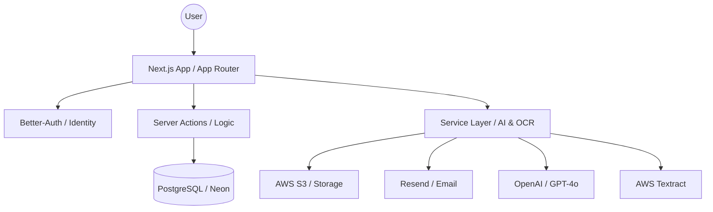

# Infradyn Technical Overview

Welcome to the Infradyn Technical Documentation. This document provides a high-level overview of the platform's architecture, technology stack, and core principles.

## System Architecture

Infradyn is built as a modern, multi-tenant SaaS platform focused on infrastructure procurement and supply chain management.

## Technology Stack

| Component | Technology |
| :--- | :--- |
| **Framework** | Next.js 15+ (App Router) |
| **Language** | TypeScript |
| **Database** | PostgreSQL (Neon) |
| **ORM** | Drizzle ORM |
| **Authentication** | Better-Auth |
| **Styling** | Tailwind CSS 4 |
| **Components** | Radix UI / Shadcn UI |
| **File Storage** | AWS S3 |
| **Transactional Email** | Resend |
| **AI / OCR** | OpenAI API & AWS Textract |

## Core Principles

### 1. Multi-Tenancy
Data isolation is enforced at the database level using `organization_id` across almost all tables. The application uses a hybrid approach where users belong to a primary organization but can be invited to others.

### 2. Auditability
Every financial and quality-related action is logged in an immutable audit trail. This is critical for the "Big Corporation" requirements where accountability is paramount.

### 3. Human-in-the-Loop AI
AI is used to automate data ingestion (PDF parsing, OCR), but every extracted field undergoes a validation step where a Project Manager can review and correct data before it hits the production ledger.

### 4. Role-Based Access Control (RBAC)
Granular permissions are managed through a centralized RBAC middleware, ensuring that Suppliers, Site Receivers, and Quality Engineers only see the data relevant to their specific tasks.

---

## Documentation Index

- [Phase 1: Foundation & Identity](./phase-1-foundation.md)
- [Phase 2: Procurement & BOQ Engine](./phase-2-procurement.md)
- [Phase 3: Supplier Ecosystem](./phase-3-suppliers.md)
- [Phase 4: Dual-Path Ingestion & Tracking](./phase-4-tracking.md)
- [Phase 5: AI Ingestion & Change Orders](./phase-5-ingestion.md)
- [Phase 6: Logistics & Delivery Tracking](./phase-6-logistics.md)
- [Phase 7: Quality Excellence & NCR](./phase-7-quality.md)
- [Phase 8: Dashboards & Analytics](./phase-8-analytics.md)
- [API Reference](./api/API_REFERENCE.md)
- [Data Model & Calculations](./guides/CALCULATIONS.md)
- **[Handover: Environment Setup](./handover/ENVIRONMENT.md)**
- **[Handover: Maintenance Guide](./handover/MAINTENANCE.md)**
