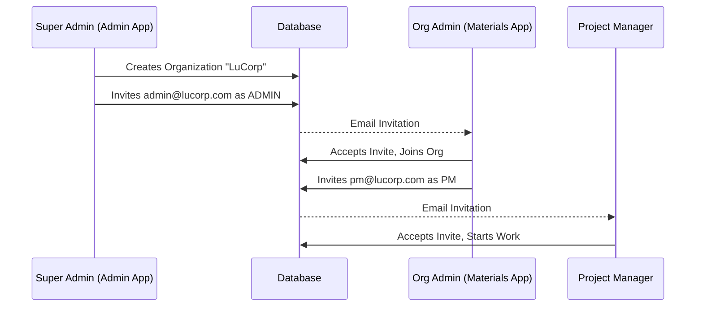

# Infradyn-Admin: Delegated Admin Integration Guide

This guide outlines the changes required in the `infradyn-admin` repository to complete the Delegated Administration model.

---

## Summary

The Super Admin panel should **only** allow inviting users with the `ADMIN` role. All other roles (PM, Supplier, QA, Site Receiver) are now managed exclusively by the Organization Admin within the Materials App.

---

## Required Changes

### 1. Restrict Role Selection in Invite User Form

**File**: (e.g., `src/app/admin/organizations/[id]/invite/page.tsx` or similar)

**Current State**: The role dropdown likely includes all options (PM, SUPPLIER, etc.).

**Change**: Filter the role options to only show `ADMIN`.

```tsx
// Before
const roleOptions = ["ADMIN", "PM", "SUPPLIER", "QA", "SITE_RECEIVER"];

// After
const roleOptions = ["ADMIN"]; // Super Admin can only invite Admins
```

Alternatively, hide the dropdown entirely and hardcode the role to `ADMIN`:
```tsx
<input type="hidden" name="role" value="ADMIN" />
<p className="text-muted-foreground">New user will be added as an Organization Admin.</p>
```

---

### 2. (Optional) "Create Organization" Flow Enhancement

When a Super Admin creates a new organization, you can streamline the flow by prompting for the first Admin email immediately.

**Suggested UX**:
1. Super Admin fills out Org Name and Slug.
2. A second field appears: "Admin Email".
3. On submit, the system creates the Org *and* sends the first Admin invite in a single transaction.

---

### 3. Readonly "Organization Members" View

Super Admins should still be able to *see* who is in an organization, even if they can't directly invite PMs.

**Implementation**:
- Add a new page/section: `/admin/organizations/[id]/members`.
- Fetch all `member` records for that `organizationId`.
- Display in a simple table (Name, Email, Role, Joined Date).
- Disable any "Invite" or "Remove" buttons on this view.

---

## Sequence Diagram



---

## Checklist

- [ ] Restrict role dropdown to `ADMIN` only in invite form.
- [ ] (Optional) Add "Admin Email" field to Create Organization form.
- [ ] (Optional) Add readonly "Members" view for each organization.
